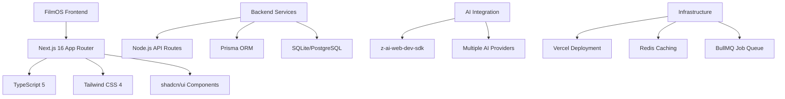

# 🎬 FilmOS - Digital Film Operating System


**The Complete Film Production Ecosystem - From Script to Screen**

[](https://opensource.org/licenses/MIT)
[](https://nextjs.org/)
[](https://www.typescriptlang.org/)
[](https://tailwindcss.com/)

[Live Demo](https://filmos-demo.vercel.app) • [Documentation](#documentation) • [Report Bug](https://github.com/jitenkr2030/Digital-Film-Operating-System/issues) • [Request Feature](https://github.com/jitenkr2030/Digital-Film-Operating-System/issues)

</div>

## 🌟 Overview

FilmOS is a revolutionary **Digital Film Operating System** that powers every aspect of modern film production with AI-driven intelligence and enterprise-grade infrastructure. Transform your production workflow from chaotic to streamlined with our comprehensive suite of tools designed for filmmakers, production companies, and studios.

## 🚀 Key Features

### 🧩 **1️⃣ Pre-Production Suite**
- **🎯 Script Intelligence Engine**: AI-powered script analysis, scene breakdown, character extraction, and emotion heatmaps
- **🎨 Visual Development Lab**: AI storyboard generation, character look development, mood boards, and cinematic previews
- **💰 Smart Budget Planner**: Intelligent budget calculation, shooting day estimation, and risk analysis

### 🎥 **2️⃣ Production Management System**
- **📅 Shooting Scheduler**: Calendar-based scheduling with weather integration and conflict detection
- **👥 Crew & Vendor Marketplace**: Verified crew profiles, equipment rental, and direct booking
- **💳 Expense & Payroll Dashboard**: Real-time expense tracking and automated payroll processing

### 💸 **3️⃣ Film Financing Platform**
- **📊 Investor Portal**: Pitch deck hosting, ROI projections, and digital contract signing
- **📈 Revenue Tracking Engine**: Multi-platform revenue tracking and profit distribution

### 📡 **4️⃣ Distribution & Rights Marketplace**
- **🌍 Rights Exchange Platform**: Territory-based rights listing and automated revenue sharing
- **📢 Distribution Analytics**: Performance tracking and deal management

### 🎬 **5️⃣ AI Marketing Automation Suite**
- **🎬 Trailer & Promo Generator**: AI trailer creation and multi-language voice dubbing
- **📊 Campaign Analytics**: Social engagement tracking and marketing ROI

### 📂 **6️⃣ Legal & Compliance Hub**
- **⚖️ Contract Management**: Template library and digital signature integration
- **🔒 Compliance Tracking**: Expiry alerts and audit logs

### 🧠 **7️⃣ AI Data Intelligence Layer**
- **📈 Genre Analytics**: Performance trends and audience insights
- **🎯 Success Prediction**: AI-powered hit probability scoring

### 🔐 **8️⃣ Enterprise Security Layer**
- **🛡️ Role-Based Access Control**: Granular permissions and user management
- **🔒 Data Protection**: Encryption, watermarking, and leak detection

## 🏗️ Architecture

FilmOS is built on a modern, scalable technology stack:



## 🛠️ Technology Stack

- **Framework**: Next.js 16 with App Router
- **Language**: TypeScript 5
- **Styling**: Tailwind CSS 4 + shadcn/ui
- **Database**: Prisma ORM with SQLite/PostgreSQL
- **Authentication**: NextAuth.js v4
- **State Management**: Zustand + TanStack Query
- **AI Integration**: z-ai-web-dev-sdk
- **Deployment**: Vercel/Docker

## 📦 Installation

### Prerequisites

- Node.js 18.18.0 or higher
- npm 9.0.0 or higher
- Git

### Quick Start

1. **Clone the repository**
   ```bash
   git clone https://github.com/jitenkr2030/Digital-Film-Operating-System.git
   cd Digital-Film-Operating-System
   ```

2. **Install dependencies**
   ```bash
   npm install
   # or
   bun install
   ```

3. **Set up environment variables**
   ```bash
   cp .env.example .env.local
   # Edit .env.local with your configuration
   ```

4. **Initialize the database**
   ```bash
   npx prisma generate
   npx prisma db push
   ```

5. **Start the development server**
   ```bash
   npm run dev
   # or
   bun run dev
   ```

6. **Open your browser**
   Navigate to [http://localhost:3000](http://localhost:3000)

### Docker Setup

```bash
# Build and run with Docker
docker-compose up -d

# View logs
docker-compose logs -f
```

## 🔧 Configuration

### Environment Variables

Create a `.env.local` file with the following variables:

```env
# Database
DATABASE_URL="file:./dev.db"

# NextAuth.js
NEXTAUTH_SECRET="your-secret-key"
NEXTAUTH_URL="http://localhost:3000"

# AI Services
OPENAI_API_KEY="your-openai-key"
GOOGLE_AI_API_KEY="your-google-ai-key"

# External Services
REDIS_URL="redis://localhost:6379"
```

### AI Provider Setup

1. **OpenAI**: Get API key from [OpenAI Platform](https://platform.openai.com/)
2. **Google AI**: Get API key from [Google AI Studio](https://aistudio.google.com/)
3. **Configure providers** in the Settings panel

## 📖 Usage Guide

### Getting Started

1. **Create Your First Project**
   - Click "New Project" on the dashboard
   - Enter project details and select production type
   - Choose your subscription plan

2. **Upload Your Script**
   - Navigate to Pre-Production Suite
   - Use Script Intelligence Engine to analyze your script
   - Review AI-generated breakdowns and insights

3. **Plan Your Budget**
   - Use Smart Budget Planner for cost estimation
   - Set contingency buffers and track expenses
   - Generate investor-ready reports

4. **Schedule Production**
   - Access Shooting Scheduler
   - Plan shooting days with weather integration
   - Manage cast, crew, and equipment

### Advanced Features

- **AI Visual Development**: Generate storyboards and character concepts
- **Crew Marketplace**: Find and hire verified professionals
- **Investor Portal**: Create pitch decks and manage investments
- **Rights Management**: Track distribution rights globally

## 🎯 Monetization Model

FilmOS operates on a flexible SaaS model:

| Plan | Features | Pricing |
|------|----------|---------|
| **Starter** | Script + Budget tools | $99/month |
| **Pro** | Production + Marketing | $499/month |
| **Studio** | Full lifecycle + Investor | $1,999/month |
| **Enterprise** | Custom deployment | Custom pricing |

### Additional Revenue Streams
- Per-project usage fees
- Commission on funding deals (2-5%)
- Commission on rights sales (3-7%)
- Marketplace transaction fees (1-2%)

## 🤝 Contributing

We welcome contributions! Please see our [Contributing Guide](CONTRIBUTING.md) for details.

### Development Setup

1. Fork the repository
2. Create a feature branch: `git checkout -b feature/amazing-feature`
3. Make your changes
4. Run tests: `npm run test`
5. Commit changes: `git commit -m 'Add amazing feature'`
6. Push to branch: `git push origin feature/amazing-feature`
7. Open a Pull Request

### Code Style

- Use TypeScript for all new code
- Follow ESLint configuration
- Write tests for new features
- Update documentation

## 📊 Roadmap

### Phase 1: Core Platform ✅
- [x] Pre-Production Suite
- [x] Basic Production Management
- [x] AI Script Analysis
- [x] Budget Planning

### Phase 2: Production Tools 🚧
- [ ] Full Crew Marketplace
- [ ] Equipment Rental System
- [ ] Advanced Scheduling
- [ ] Expense Management

### Phase 3: Business Tools 📋
- [ ] Investor Portal
- [ ] Rights Marketplace
- [ ] Marketing Suite
- [ ] Legal Hub

### Phase 4: Enterprise Features 🔮
- [ ] Advanced Analytics
- [ ] Multi-tenant Support
- [ ] API Ecosystem
- [ ] Mobile Apps

## 🐛 Troubleshooting

### Common Issues

**Build Errors**
```bash
# Clear Next.js cache
rm -rf .next
npm run build
```

**Database Issues**
```bash
# Reset database
npx prisma db push --force-reset
npx prisma generate
```

**AI Service Errors**
- Check API keys in environment variables
- Verify service provider status
- Review rate limits and quotas

### Performance Tips

- Use React.memo for expensive components
- Implement proper caching strategies
- Optimize database queries
- Use Next.js Image optimization

## 📄 License

This project is licensed under the MIT License - see the [LICENSE](LICENSE) file for details.

## 🙏 Acknowledgments

- **Next.js Team** - For the amazing framework
- **shadcn/ui** - For beautiful UI components
- **Prisma** - For the excellent ORM
- **Vercel** - For the hosting platform
- **Our Contributors** - For making FilmOS possible

## 📞 Support

- **Documentation**: [docs.filmos.com](https://docs.filmos.com)
- **Discord Community**: [Join our Discord](https://discord.gg/filmos)
- **Twitter**: [@FilmOS](https://twitter.com/filmos)
- **Email**: support@filmos.com

---

<div align="center">

**🎬 Transform Your Production Workflow with FilmOS**

*Built with ❤️ by the FilmOS Team*

[⭐ Star this repo](https://github.com/jitenkr2030/Digital-Film-Operating-System) • [🐛 Report Issues](https://github.com/jitenkr2030/Digital-Film-Operating-System/issues) • [📖 Documentation](https://docs.filmos.com)

</div>
